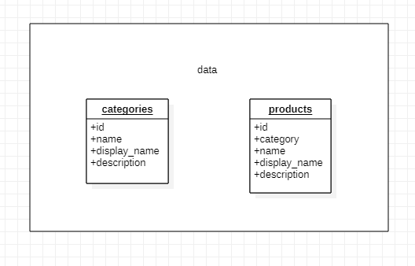

## Project: api-server

### Author: Husam Ajour

### Links and Resources

- [ci/cd](https://github.com/HusamAjour/api-server) (GitHub Actions)
- [back-end server url](http://localhost:3000/)
- [front-end application]() (when applicable)
- [Swagger](https://app.swaggerhub.com/apis/HusamAjour/api-server/0.1)

### Setup

i.e.

- `PORT` - Port Number
- `MONGODB_URI` - URL to the running mongo instance/db

#### How to initialize/run your application (where applicable)

- e.g. `nodemon` or `npm start`

#### Endpoints

- e.g. `GET /categories/` to get all categories.
- e.g. `GET /categories/1` to get a categorey by its id.
- e.g. `GET /products/` to get all products.
- e.g. `GET /products/1` to get a product by its id.
- e.g. `PUT /categories/1` to update a category by its id.
- e.g. `PUT /products/1` to update a product by its id.
- e.g. `POST /categories/` to add a new category.
- e.g. `POST /products/` to add a new product.
- e.g. `DELETE /categories/1` to delete a category by its id.
- e.g. `DELETE /products/1` to delete a product by its id.

#### Tests

run `npm test`

#### UML

